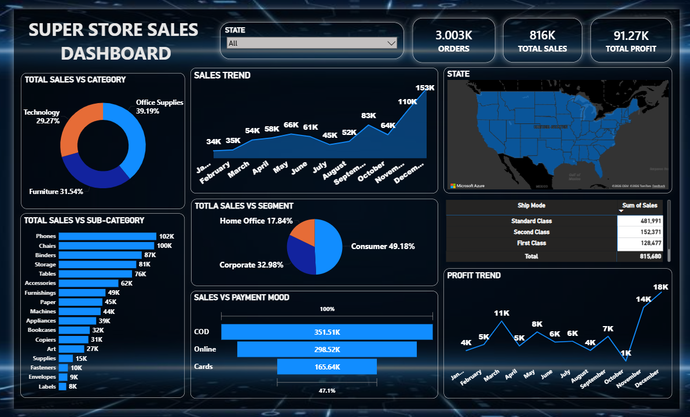

# 🛒 Super Store Sales Analysis Dashboard

## Power BI Project

## 📄 Overview
This project analyzes the retail performance of a **Super Store**, focusing on sales growth, profitability, and customer purchasing behavior. The dashboard provides insights into product categories, shipping modes, and payment methods to optimize retail operations.

## 🖼️ Dashboard Preview

## 🔑 Key Metrics
* **Total Orders:** 3.003K
* **Total Sales:** 816K
* **Total Profit:** 91.27K
* **Leading Segment:** **Consumer** (49.18% of total sales).

## 🚀 Main Insights

* **📈 Sales & Profit Trends:** Both sales and profits reached their absolute peak in **December**, with sales hitting **153K** and profits reaching **18K**, indicating a strong end-of-year holiday season.
  
* **📦 Product Performance:** **Office Supplies** is the dominant category by volume (39.19
*
